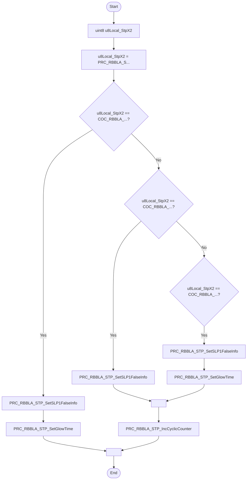

# Flow Chart for PRC_RBBLA_STP0OutputX2

```mermaid
graph TD
start([Start])
action1["uint8 u8Local_StpX2"]
action2["u8Local_StpX2 = PRC_RBBLA_S..."]
if3{u8Local_StpX2 == COC_RBBLA_...?}
action4["PRC_RBBLA_STP_SetSLP1FalseInfo"]
action5["PRC_RBBLA_STP_SetGlowTime"]
if6{u8Local_StpX2 == COC_RBBLA_...?}
action7["PRC_RBBLA_STP_SetSLP1FalseInfo"]
if8{u8Local_StpX2 == COC_RBBLA_...?}
action9["PRC_RBBLA_STP_SetSLP1FalseInfo"]
action10["PRC_RBBLA_STP_SetGlowTime"]
merge11[" "]
action12["PRC_RBBLA_STP_IncCyclicCounter"]
merge13[" "]
start --> action1
action1 --> action2
action2 --> if3
if3 -- Yes --> action4
action4 --> action5
if3 -- No --> if6
if6 -- Yes --> action7
if6 -- No --> if8
if8 -- Yes --> action9
action9 --> action10
action7 --> merge11
action10 --> merge11
merge11 --> action12
action5 --> merge13
action12 --> merge13
end_node([End])
merge13 --> end_node
```
