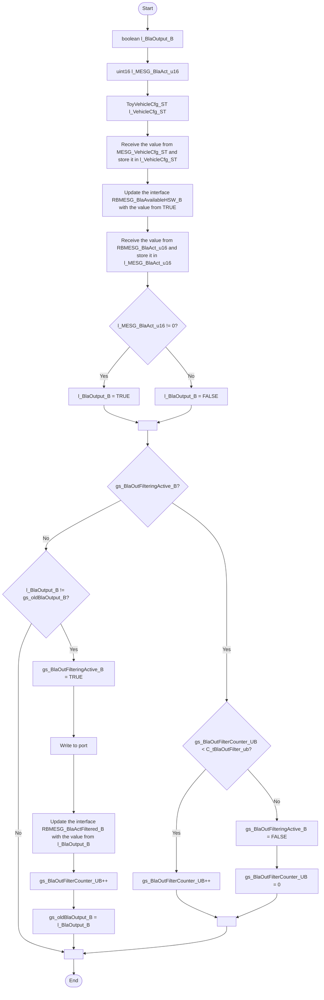

# Flow Chart for PRC_RBBLA_STP0OutputX2 (Corrected)

```mermaid
graph TD
    start([Start])
    
    %% Local variable declarations
    action1["boolean l_BlaOutput_B"]
    action2["uint16 l_MESG_BlaAct_u16"] 
    action3["ToyVehicleCfg_ST l_VehicleCfg_ST"]
    
    %% Message operations
    action4["Receive the value from MESG_VehicleCfg_ST and store it in l_VehicleCfg_ST"]
    action5["Update the interface RBMESG_BlaAvailableHSW_B with the value from TRUE"]
    action6["Receive the value from RBMESG_BlaAct_u16 and store it in l_MESG_BlaAct_u16"]
    
    %% First decision: BLA activation check
    if7{l_MESG_BlaAct_u16 != 0?}
    action8["l_BlaOutput_B = TRUE"]
    action9["l_BlaOutput_B = FALSE"]
    merge10[" "]
    
    %% Second decision: Filtering active check
    if11{gs_BlaOutFilteringActive_B?}
    
    %% YES branch of filtering active
    if12{gs_BlaOutFilterCounter_UB < C_tBlaOutFilter_ub?}
    action13["gs_BlaOutFilterCounter_UB++"]
    action14["gs_BlaOutFilteringActive_B = FALSE"]
    action15["gs_BlaOutFilterCounter_UB = 0"]
    merge16[" "]
    
    %% NO branch of filtering active  
    if17{l_BlaOutput_B != gs_oldBlaOutput_B?}
    action18["gs_BlaOutFilteringActive_B = TRUE"]
    action19["Write to port"]
    action20["Update the interface RBMESG_BlaActFiltered_B with the value from l_BlaOutput_B"]
    action21["gs_BlaOutFilterCounter_UB++"]
    action22["gs_oldBlaOutput_B = l_BlaOutput_B"]
    
    %% Final merge
    merge23[" "]
    end_node([End])
    
    %% Flow connections
    start --> action1
    action1 --> action2
    action2 --> action3
    action3 --> action4
    action4 --> action5
    action5 --> action6
    action6 --> if7
    
    %% BLA activation decision branches
    if7 -- Yes --> action8
    if7 -- No --> action9
    action8 --> merge10
    action9 --> merge10
    
    %% Filtering decision
    merge10 --> if11
    
    %% Filtering active YES branch
    if11 -- Yes --> if12
    if12 -- Yes --> action13
    if12 -- No --> action14
    action13 --> merge16
    action14 --> action15
    action15 --> merge16
    
    %% Filtering active NO branch
    if11 -- No --> if17
    if17 -- Yes --> action18
    if17 -- No --> merge23
    action18 --> action19
    action19 --> action20
    action20 --> action21
    action21 --> action22
    action22 --> merge23
    
    %% Final convergence
    merge16 --> merge23
    merge23 --> end_node
```