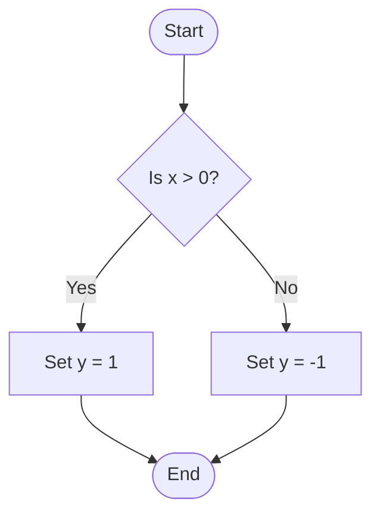
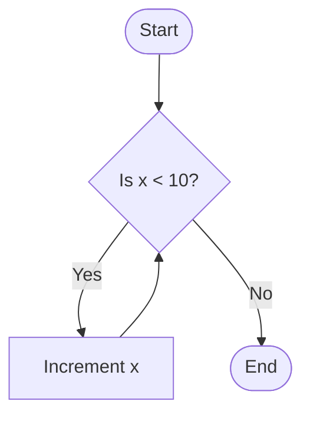
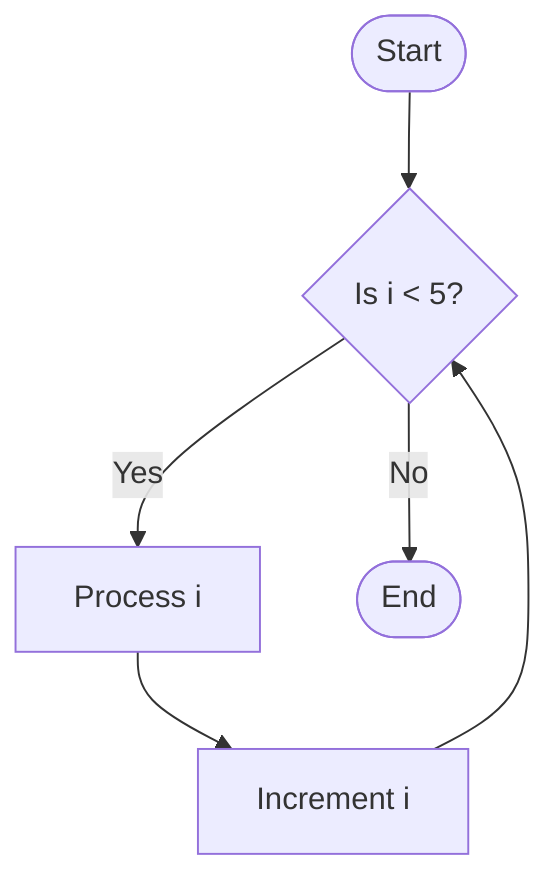
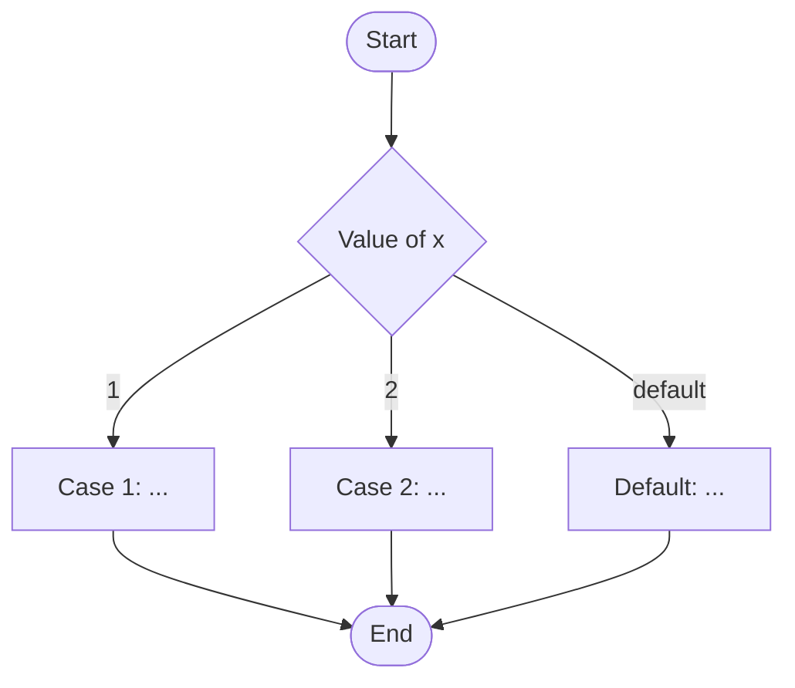

# Example: If-Else Statement Flowchart (Mermaid)

// C code for reference:
// if (x > 0) {
//     y = 1;
// } else {
//     y = -1;
// }

# Example: While Loop Flowchart (Mermaid)

// C code for reference:
// while (x < 10) {
//     x++;
// }

# Example: For Loop Flowchart (Mermaid)

// C code for reference:
// for (int i = 0; i < 5; i++) {
//     // Process i
// }

# Example: Switch Statement Flowchart (Mermaid)

// C code for reference:
// switch (x) {
//   case 1:
//     // ...
//     break;
//   case 2:
//     // ...
//     break;
//   default:
//     // ...
// }